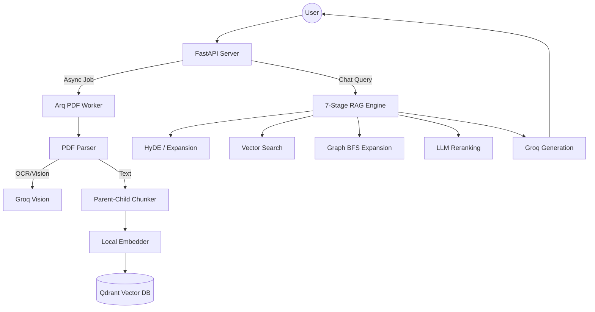

# DocuVerse v2 – Advanced Agentic RAG

**DocuVerse** is a high-performance, multi-stage RAG (Retrieval-Augmented Generation) engine designed for precise document Q&A. It utilizes the blazing-fast **Groq API** and specialized local processing to handle complex PDFs, images, and tables with 100% accuracy.

## 🚀 Key Features

*   **7-Stage RAG Pipeline**: HyDE, Query Expansion, Dense Search, RRF, Graph RAG, Reranking, and Context Compression.
*   **Multimodal Extraction**: Automatically converts PDF images into text descriptions using `llama-3.2-11b-vision`.
*   **Graph RAG**: Uses a NetworkX-based knowledge graph for entity-linked retrieval.
*   **Table Reconstruction**: Intelligent Y-coordinate clustering for perfect table parsing.
*   **Free & Fast**: Powered by Groq's LPUs for near-instant responses.

## 🏗️ Architecture



## 🛠️ Tech Stack

| Service | Technology | Purpose |
|---|---|---|
| **Language** | Python 3.11 | Backend logic |
| **LLM / Vision** | [Groq API](https://console.groq.com) | Ultra-fast inference (`llama-3.3-70b-versatile`) |
| **Vector DB** | [Qdrant](https://qdrant.tech/) | High-performance vector storage |
| **Embeddings** | `all-MiniLM-L6-v2` | Local semantic vectorization |
| **Graph DB** | NetworkX | Entity-relationship management |
| **Queue** | Valkey + Arq | Reliable background processing |

## ⚡ Quick Start

### 1 — Configure API Keys
Obtain a free API key from the [Groq Console](https://console.groq.com/keys) and add it to your `.env` file in the `server` directory:

```env
GROQ_API_KEY=your_groq_key_here
LLM_MODEL=llama-3.3-70b-versatile
VISION_MODEL=llama-3.2-11b-vision-preview
```

### 2 — Launch with Docker
```bash
docker compose up --build -d
```
The API will be available at **http://localhost:8000**.

### 3 — Launch Frontend
```bash
cd client
npm install
npm run dev
```

## 🔌 API Endpoints

| Method | Endpoint | Description |
|---|---|---|
| `POST` | `/upload/pdf` | Uploads PDF for parsing & indexing |
| `GET` | `/collections` | Lists all your document collections |
| `GET` | `/chat` | Executes the full 7-stage agentic RAG query |
| `GET` | `/summarize/{id}` | Generates a high-level summary of a document |
| `DELETE` | `/collections/{id}` | Permanently removes document data |

## ⚙️ Environment Configuration

| Variable | Default | Purpose |
|---|---|---|
| `GROQ_API_KEY` | *(Required)* | API Key for LLM and Vision models |
| `LLM_MODEL` | `llama-3.3-70b-versatile` | Primary chat model |
| `VISION_MODEL` | `llama-3.2-11b-vision-preview` | Model for image descriptions |
| `QDRANT_URL` | `http://qdrant:6333` | Vector DB endpoint |
| `REDIS_HOST` | `valkey` | Background worker broker |

---
*Built with ❤️ for High-Performance RAG.*

